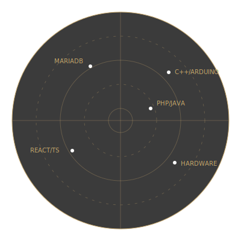

  

 

  
  
  

  

  
<b><code>[+] // DOSSIER DECRYPTED : OVERVIEW</code></b>

   
  <table>
    <tr>
      <td width="60%">
        <b>IDENTIFICATION:</b> DRIAN VILLAROSA 
        <b>CODENAME:</b> SPECTER-009 
        <b>STATION:</b> ARRAKIS SECTOR // COORDINATES CLASSIFIED 
        <b>DISCIPLINES:</b> EMBEDDED SYSTEMS / FULL STACK / ROBOTICS 
         
        <i>Operates in low-noise, high-output mode. Effective across hardware and software. Comfortable in constrained environments.</i>
      </td>
      <td width="40%" align="center">
        
      </td>
    </tr>
  </table>

 

  
<b><code>[+] // ARSENAL : TECHNICAL CAPABILITIES</code></b>

   
  

    
      
    
  

 

  
<b><code>[+] // MISSION LOGS : ACTIVE & COMPLETED OPERATIONS</code></b>

   
  <table>
    <tr>
      <td width="50%" valign="top">
        <b><code>OPS-001</code> <a href="https://github.com/Specter-009/arduino-line-follower-obstacle-robot">AUTONOMOUS GROUND UNIT</a></b> 
        Navigates, detects, adapts. C++, Arduino, Sensor Fusion.
      </td>
      <td width="50%" valign="top">
        <b><code>OPS-002</code> <a href="https://github.com/Specter-009/MapNotes">MAPNOTES INTELLIGENCE</a></b> 
        Geographic annotation system. HTML, CSS, JavaScript.
      </td>
    </tr>
    <tr>
      <td width="50%" valign="top">
        <b><code>OPS-003</code> <a href="https://github.com/Specter-009/manoloAccess">MANOLOACCESS TICKETING</a></b> 
        High-volume processing. Java, NetBeans, MariaDB.
      </td>
      <td width="50%" valign="top">
        <b><code>OPS-004</code> <a href="https://github.com/Specter-009/ReactProject">IONIC REACT GROUND</a></b> 
        Active development environment. TypeScript, React.
      </td>
    </tr>
    <tr>
      <td width="50%" valign="top">
        <b><code>OPS-005</code> <a href="https://github.com/foodwaste-management/foodwaste">FOODWASTE MANAGEMENT</a></b> 
        Collaborative tracking. PHP, Web.
      </td>
      <td width="50%" valign="top">
        <b><code>OPS-006</code> <a href="https://esp-32-dht-11-temp-humidity-logger.vercel.app/">ESP32 FIELD LOGGER</a></b> 
        Live monitoring via ESP32. C++, Vercel.
      </td>
    </tr>
  </table>

 

  
<b><code>[+] // SURVEILLANCE : OPERATIONAL TIMELINE</code></b>

   
  

    <!-- Activity Timeline -->
    
      
    <!-- Contribution Grid Snake -->
    <picture>
      <source media="(prefers-color-scheme: dark)" srcset="https://raw.githubusercontent.com/Specter-009/Specter-009/output/github-contribution-grid-snake-dark.svg" />
      <source media="(prefers-color-scheme: light)" srcset="https://raw.githubusercontent.com/Specter-009/Specter-009/output/github-contribution-grid-snake.svg" />
      
    </picture>
  

 

  
<b><code>[+] // SECURE COMM-LINK : CONTACT PROTOCOL</code></b>

   
  

    
    
  

  

  
    
  <code>THIS FILE WILL SELF-DESTRUCT IN 5... 4... 3... 2... 1...  // CONNECTION TERMINATED.</code>

