

  

 

  
  
  

  

  
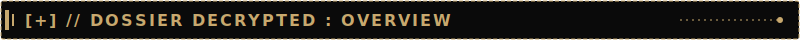

   
  <table>
    <tr>
      <td width="60%">
        <b>IDENTIFICATION:</b> ADRIAN VILLAROSA 
        <b>CODENAME:</b> SPECTER-009 
        <b>STATION:</b> ARRAKIS SECTOR // COORDINATES CLASSIFIED 
        <b>PROJECTS:</b>
         
        => https://esp-32-dht-11-temp-humidity-logger.vercel.app/ 
          
        => https://esp32-iron-traffic-light-control.vercel.app/ 
          
        => https://esp32-led-control-iron-man-theme.vercel.app/ 
         
      </td>
    </tr>
  </table>

 

  
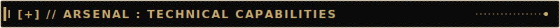

   
  

    
      
    
  

 

  
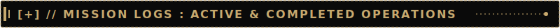

   
  

    <a href="https://github.com/Specter-009/arduino-line-follower-obstacle-robot">
      
    </a>
    <a href="https://github.com/Specter-009/MapNotes">
      
    </a>
     
    <a href="https://github.com/Specter-009/manoloAccess">
      
    </a>
    <a href="https://github.com/Specter-009/ReactProject">
      
    </a>
     
    <a href="https://github.com/foodwaste-management/foodwaste">
      
    </a>
    <a href="https://esp-32-dht-11-temp-humidity-logger.vercel.app/">
      
    </a>
  

 

  
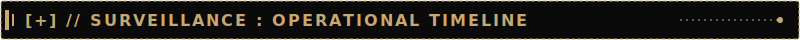

   
  

    
      
    <picture>
      <source media="(prefers-color-scheme: dark)" srcset="https://raw.githubusercontent.com/Specter-009/Specter-009/output/github-contribution-grid-snake-dark.svg" />
      <source media="(prefers-color-scheme: light)" srcset="https://raw.githubusercontent.com/Specter-009/Specter-009/output/github-contribution-grid-snake.svg" />
      
    </picture>
  

 

  
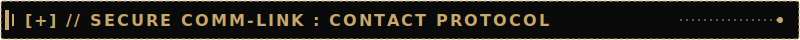

   
  

    
    
  

  

  
    
  <code>THIS FILE WILL SELF-DESTRUCT IN 5... 4... 3... 2... 1...  // CONNECTION TERMINATED.</code>

