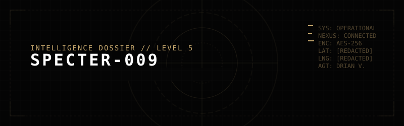

<div align="center">
  
</div>

<br>

<div align="left">

```typescript
const specter_009: Developer = {
  name: "Adrian Villarosa",
  station: "Northern Bukidnon State College",
  field: "Information Technology",
  role: "Website Manager at Ballpoint",
  expertise: ["Fullstack Development", "IoT", "Application Design"]
};
```

</div>

<div align="center">
  <a href="mailto:your-email@example.com">
    
  </a>
  <a href="https://github.com/Specter-009">
    
  </a>
</div>

<br>

---

<div align="center">

## 𝘽𝙧𝙞𝙚𝙛𝙞𝙣𝙜

I am a dedicated **Information Technology student** at Northern Bukidnon State College with a strong passion for continuous learning and growth in the field. I focus on understanding how hardware and software work together, from building **IoT systems** using Arduino to developing **web and desktop applications**. I enjoy creating practical and efficient solutions while constantly improving my skills and knowledge.

</div>

<br>

---

## 𝙁𝙞𝙚𝙡𝙙 𝘼𝙘𝙩𝙞𝙫𝙞𝙩𝙮 & 𝙎𝙩𝙖𝙩𝙨

<p align="center">
  
</p>

<p align="center">
  
</p>

<br>

---

## 𝙏𝙚𝙘𝙝𝙣𝙞𝙘𝙖𝙡 𝘼𝙧𝙨𝙚𝙣𝙖𝙡

### 𝙒𝙚𝙗 𝘿𝙚𝙫𝙚𝙡𝙤𝙥𝙢𝙚𝙣𝙩
<p align="left">
  
</p>

### 𝙎𝙤𝙛𝙩𝙬𝙖𝙧𝙚 & 𝙃𝙖𝙧𝙙𝙬𝙖𝙧𝙚
<p align="left">
  
</p>

### 𝙂𝙖𝙢𝙚 𝘿𝙚𝙫𝙚𝙡𝙤𝙥𝙢𝙚𝙣𝙩
<p align="left">
  
</p>

### 𝘿𝙖𝙩𝙖𝙗𝙖𝙨𝙚 & 𝘾𝙡𝙤𝙪𝙙
<p align="left">
  
</p>

### 𝙏𝙤𝙤𝙡𝙨 & 𝙀𝙣𝙫𝙞𝙧𝙤𝙣𝙢𝙚𝙣𝙩
<p align="left">
  
  
</p>

<br>

---

## 𝘼𝙘𝙩𝙞𝙫𝙚 𝙋𝙧𝙤𝙟𝙚𝙘𝙩𝙨

<div align="center">
  <table>
    <tr>
      <td width="33%" align="center">
        <strong>𝘼𝙏𝙈𝙊𝙎</strong><br>
        <a href="https://atmos-weather-monitoring.vercel.app/">Live Demo</a><br>
        <em>Weather Monitoring</em>
      </td>
      <td width="33%" align="center">
        <strong>𝙄𝙧𝙤𝙣 𝙏𝙧𝙖𝙛𝙛𝙞𝙘</strong><br>
        <a href="https://esp32-iron-traffic-light-control.vercel.app/">Live Demo</a><br>
        <em>IoT Signal Control</em>
      </td>
      <td width="33%" align="center">
        <strong>𝙄𝙧𝙤𝙣 𝙈𝙖𝙣 𝙇𝙀𝘿</strong><br>
        <a href="https://esp32-led-control-iron-man-theme.vercel.app/">Live Demo</a><br>
        <em>Hardware Interface</em>
      </td>
    </tr>
  </table>
</div>

<br>

### 𝙁𝙪𝙩𝙪𝙧𝙚 𝙊𝙥𝙚𝙧𝙖𝙩𝙞𝙤𝙣𝙨
> [!TIP]
> **[LEARNING & BUILDING]**
> Experimenting with fullstack development and IoT to improve system design and implementation skills.

<br>

---

<div align="center">
  
  <br>
  <code>CONNECTION SECURE // SPECTER-009 // BSIT NBSC</code>
</div>
